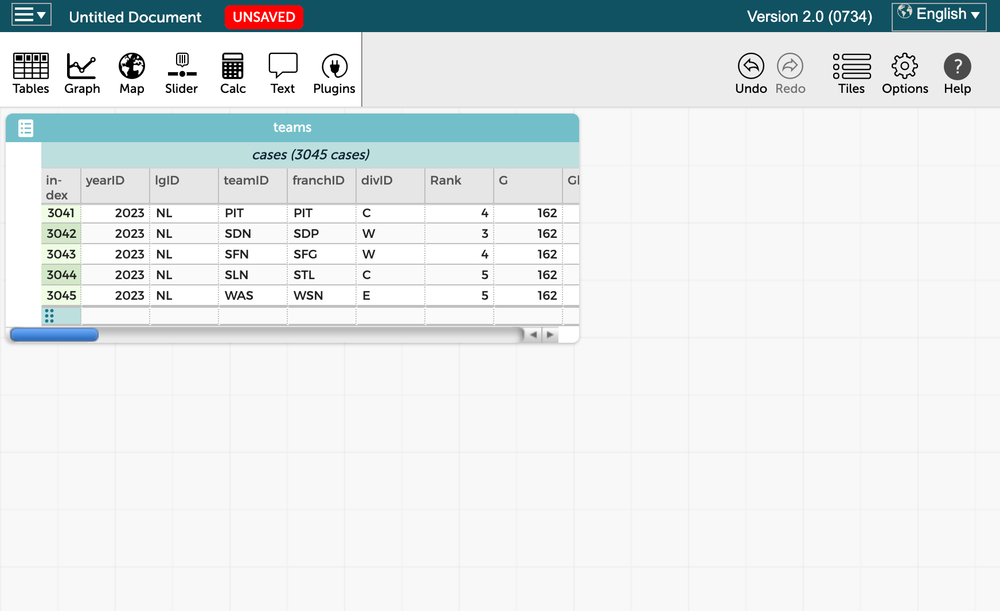

<!-- _backgroundColor: aqua -->

# **STEMTeach 2025 Spring Mentor Day**

## Data Analytics & Sports

---

# Data Analytics

What is it?

- **Definition:** Data analytics involves examining datasets to draw conclusions about the information they contain. It uses various techniques to uncover patterns, correlations, and trends.

- **Relevance:** In today's data-driven world, the ability to analyze and interpret data is a crucial skill across various fields, including education, business, healthcare, and sports.

---

# Recognizing Patterns

- **Decision-Making:** Identifying patterns in data helps make informed decisions. For example, in sports, recognizing performance trends can guide player selection, game strategies, and training focus.

- **Predictive Power:** Patterns can reveal insights about future outcomes. By understanding historical data, we can make predictions and prepare for potential scenarios.

- **Efficiency:** Recognizing patterns allows for more efficient problem-solving. Instead of addressing issues on a case-by-case basis, we can apply solutions that have worked in similar situations.

---

# Real-World Applications

Sports

> Teams use data analytics to evaluate player performance, develop game strategies, and enhance training programs. For instance, analyzing batting averages and on-base percentages can help identify key players.

Business

> Companies analyze consumer data to understand buying behaviors, optimize marketing campaigns, and improve customer satisfaction. Recognizing sales patterns can drive business growth.

Education
 

> Educators can use data to track student progress, identify learning gaps, and tailor instruction to meet individual needs. Recognizing patterns in student performance data can lead to more effective teaching strategies.

---

# Today's Plan

## CODAP

https://codap.concord.org/

- Free, web-based data analysis and visualization tool developed by the Concord Consortium. 
- Designed to support students in grades 5-12 in learning and doing data science.

## Baseball
What data is collected?

[Lahman Baseball Database (seanlahman.com)](http://seanlahman.com/)

- Relatable, real-world, and fun context
- Interactive, hands-on activity
- Skill development
    - Critical thinking and analytical skills for students.
    - [Meta] Enhance educators' ability to assess student performance and improve instructional methods.

---

# Let's Go!

- Visit https://codap.concord.org/ 
    - Click ***Launch CODAP***
    - ***Create a new Document***
    - From the menu, "***Import...***" 
        - Click "***URL***" 
        - Enter:

***https://cs.berry.edu/stemteach-s25/teams.csv***

---

# Data Table & Schema

[Teams Table Schema handout](./teams-schema.pdf)

- How many rows are there?
- What range of years is in the data?
- Sort by "rank" (ascending); then "year" (descending)
- Explore...

---

# Graph

How many World Series winners are there?

- Add "WSWin" to the "X"
- Click the ruler - Show... "Count"

Is there a correlation between runs scored and number of wins?

- Add "R" to the x-axis (bottom)
- Add "W" to the y-axis (left)

Has the trend changed over time?

- Drag the "yearId" column header from the table onto the main graph area.
- Anything interesting?

"Best fit" line

- Click the ruler --> choose "Least Squares Line"

---

# Discuss - Explore - Share

- Brainstorm questions you could ask about the data 
    - Refer to the table schema

- Make a graph in CODAP to explore those questions

- Share: what do you find?

---

# Analytics Process

> https://medium.com/codex/life-cycle-of-a-data-analytics-project-954d0e6926fe

